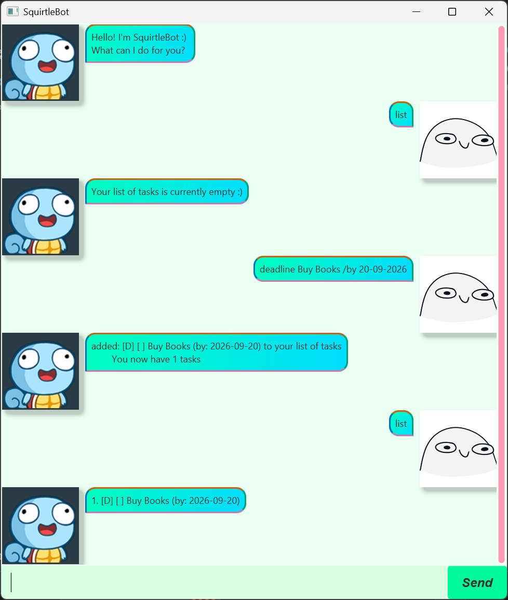

# SquirtleBot User Guide



SquirtleBot is a <b>friendly</b> assistant that helps you manage your day-to-day tasks.
It uses a chat interface to provide inputs to the bot.

## Adding deadlines: `deadline`
Adds a deadline task with 1 due date, to the list of tasks

Format: `deadline TASK_DESCRIPTION /by DUE_DATE`

Examples:
- `deadline Buy Books /by 20-09-2026`
- `deadline Submit iP final version /by 18-09-2026`

Expected Output:
```
added [D] [] Buy Books (by: 2026-09-20) to your list of tasks
    You now have 1 tasks
```

## Adding events: `event`
Adds an event task, with a start and end date to the list of tasks
- Supports tentative scheduling for events (multiple unconfirmed event periods)

Format: 
- Adding event with 1 confirmed date: `event TASK_DESCRIPTION /from START_DATE /to END_DATE`
- Adding event with multiple tentative dates: `'event TASK_DESCRIPTION /from START_DATE_1 
/to END_DATE_1 /from START_DATE_2 /TO END_DATE_2...'`

Examples:
- `event Study CS2103T /from 10-08-2026 /to 05-12-2026`
- `event Run at RUNNUS /from 19-09-2026 07:00:00 /to 19-09-2026 11:00:00`

Expected Output:
```
added: [E] [] Study CS2103T (from: 2026-08-10 to: 2026-12-05) to your list of tasks
    You now have 1 tasks
```

## Adding To Dos: `todo`
Adds a todo task, with a simple description of the task

Format: `todo TASK_DESCRIPTION`

Examples:
- `todo Complete GitMastery`
- `todo Add Increment to iP for CS2103`


Expected Output:
```
added: [T] [] Complete GitMastery to your list of task
    You now have 1 tasks
```

## Viewing created tasks: `list`
Displays current list of tasks

Format: `list`

Expected Output (if no tasks were added): `Your list of tasks is currently empty :)`

Expected Output (if tasks were added):
```
1. [D] [] Buy Books (by: 2026-09-20)
2. [E] [] Study CS2103T (from: 2026-08-10 to: 2026-12-05)
3. [T] [] Complete GitMastery
```

## Confirming an event date: `confirm`
Confirms 1 of the tentative date periods for an event

Format: `confirm ONE_BASED_INDEX_OF_EVENT_IN_LIST ONE_BASED_INDEX_OF_DATE_PERIOD`

Examples:
- `confirm 1 2`
- `confirm 3 1`

Expected Output:
```
Event updated: [E] [ ] Run at RUNNUS (from: 2026-09-19T07:00 to: 2026-09-19T11:00)
```

## Finding tasks by description: `find`
Displays tasks with a description that contains a provided value

Format: `find SEARCH_VALUE`

Examples:
- `find Books`
- `find CS2103T`

Expected Output (if no tasks contain the provided value): `Your list of tasks is currently empty :)`

Expected Output (if tasks contain the provided value):
```
[D] [] Buy Books (by: 2026-09-20)
```

## Mark tasks as done: `mark`
Marks a task as done

Format: `mark ONE_BASED_INDEX_OF_TASK_IN_LIST`

Examples:
- `mark 1`
- `mark 3`

Expected Output:
```
Congrats on completing the following task:
    [T] [X] Add increment to CS2103T
```

## Mark tasks as not done: `unmark`
Marks a completed task as not done

Format: `unmark ONE_BASED_INDEX_OF_TASK_IN_LIST`

Examples:
- `unmark 1`
- `unmark 3`

Expected Output:

```
The following task was marked as not done: [T] [ ] Add increment to CS2103T
```

## Deleting tasks: `delete`
Deletes a task from the list of tasks

Format: `delete ONE_BASED_INDEX_OF_TASK_IN_LIST`

Examples:
- `delete 1`
- `delete 3`

Expected Output:
```
The following task was removed: [T] [ ] Complete GitMastery
```

## Exiting SquirtleBot: `bye`
Exits SquirtleBot

Format: `bye`

Expected Output:
```
Bye. Hope to see you soon :(
```